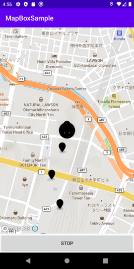

## What's this repo

This is a sample project for MapBox Android SDK.

## How to use

Click start button to set marker or pin on the map periodically (default 1 min). Stop and start resets the log. The icons on the screenshot of an emulator  are filled by black for some reason.

